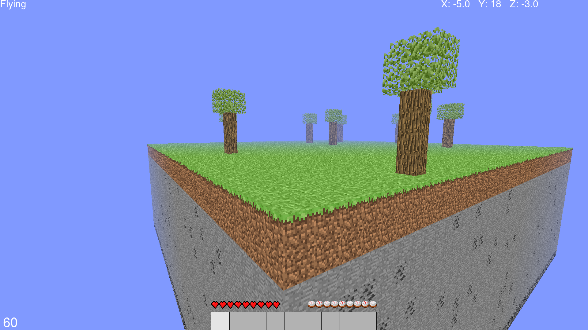

<h1 align="center">

<br>
</h1>

<h4 align="center">
  <p>My Own Minecraft 😅</p>

  <p>This application was developed using Python.</p>

</h4>

<p align="center">
  <a href="#rocket-technologies">Technologies</a>&nbsp;&nbsp;&nbsp;|&nbsp;&nbsp;&nbsp;
  <a href="#information_source-how-to-use">How To Use</a>&nbsp;&nbsp;&nbsp;|&nbsp;&nbsp;&nbsp;
  <a href="#thumbsup-how-to-contribute">How To Contribute</a>&nbsp;&nbsp;&nbsp;|&nbsp;&nbsp;&nbsp;
  <a href="#memo-license">License</a>
</p>

<p align="center">
  
</p>

## :rocket: Technologies

This project was developed with the following technologies:

-  [Python](https://www.python.org/)
-  [PyGame](https://www.pygame.org/news)
-  [PyGlet](http://pyglet.org/)

## :information_source: How to use

To clone and run this application, you'll need [Git](https://git-scm.com), [Python](https://www.python.org/) + [PyCharm](https://www.jetbrains.com/pt-br/pycharm/download/) or another IDE. <b>From your command line:

```bash
## Windows Dependencies Install
py -m pip install pyglet pygame

## Linux Dependencies Install
pip3 install pyglet pygame

# Clone this repository
$ git clone https://github.com/SirBergue/PyCraft

# Go into the repository
$ cd PyCraft

# Run the Launcher.py file (Windows)
py -m Launcher.py

# Run the Launcher.py file (Linux)
python3 Launcher.py
```

## :thumbsup: How To Contribute

-  Make a fork;
-  Create a branch with your feature: `git checkout -b my-feature`;
-  Commit changes: `git commit -m 'feat: My new feature'`;
-  Make a push to your branch: `git push origin my-feature`.

## :memo: License
This project is under the GPLv3 license. See the [LICENSE](https://github.com/SirBergue/PyCraft/blob/master/LICENSE) for more information.

---

<h4 align="center">
    Made by SirBergue 😆
</h4>
